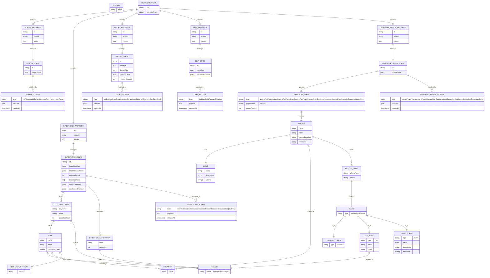

```mermaid
erDiagram
  %% Core Domain Entities
  LOCATION {
    string name
  }

  COLOR {
    string value "blue|yellow|black|red"
  }

  CITY {
    string name
    string color
    string[] connectedCities
  }

  DISEASE {
    string color
  }

  RESEARCH_STATION {
    string location
  }

  %% Card Entities
  CARD {
    string type "epidemic|city|event"
  }

  EPIDEMIC_CARD {
    string type "epidemic"
  }

  CITY_CARD {
    string type "city"
    string name
    string color
  }

  EVENT_CARD {
    string type "event"
    string name
    string description
    string[] allowedIn
  }

  %% Player and Role Entities
  ROLE {
    string name
    string description
    string[] actions
  }

  PLAYER {
    string name
    string color
    string currentLocation
    string roleName
  }

  PLAYER_HAND {
    string playerName
    string cardId
  }

  %% GamePlay State Machine
  GAMEPLAY_STATE {
    string type "waitingForPlayerAction|waitingForPlayerDraw|waitingForPlayerDiscard|startEpidemic|increaseInfectionRate|intensifyEpidemic|infectCities"
    string playerName "nullable"
    int queuePosition
  }

  %% Store State Entities
  PLAYER_STATE {
    string id
    json playersData
  }

  INFECTIONS_STATE {
    string id
    json infectionsData
    json infectionSaturation
    int outbreaksLeft
    int[] infectionRates
    json curedDiseases
    json eradicatedDiseases
  }

  CITY_INFECTIONS {
    string cityName
    string color
    int infectionCount
  }

  INFECTION_SATURATION {
    string color
    int saturation
  }

  DECKS_STATE {
    string id
    json drawPile
    json discardPile
    json infectionDeck
    json infectionDiscard
  }

  MAP_STATE {
    string id
    json mapData
    json researchStations
  }

  GAMEPLAY_QUEUE_STATE {
    string id
    json queueData
  }

  %% Action Entities
  PLAYER_ACTION {
    string type "initPlayers|addToHand|removeFromHand|movePlayer"
    json payload
    timestamp createdAt
  }

  INFECTIONS_ACTION {
    string type "initInfections|treatDisease|increaseInfectionRate|cureDisease|infect|outbreak"
    json payload
    timestamp createdAt
  }

  DECKS_ACTION {
    string type "initDecks|playerDraw|infectionDraw|discard|intensify|removeCardFromDeck"
    json payload
    timestamp createdAt
  }

  MAP_ACTION {
    string type "initMap|buildResearchStation"
    json payload
    timestamp createdAt
  }

  GAMEPLAY_QUEUE_ACTION {
    string type "queuePlayerTurns|requirePlayerDiscard|startEpidemic|nextGameplayState|skipInfection|initGameplayState"
    json payload
    timestamp createdAt
  }

  %% React Context Provider Entities
  STORE_PROVIDER {
    string id
    string contextType
  }

  PLAYER_PROVIDER {
    string id
    string stateId
    json hooks
  }

  INFECTIONS_PROVIDER {
    string id
    string stateId
    json hooks
  }

  DECKS_PROVIDER {
    string id
    string stateId
    json hooks
  }

  MAP_PROVIDER {
    string id
    string stateId
    json hooks
  }

  GAMEPLAY_QUEUE_PROVIDER {
    string id
    string stateId
    json hooks
  }

  %% Relationships
  CITY ||--|| COLOR : "has"
  CITY ||--o{ LOCATION : "connects_to"
  CITY ||--o{ RESEARCH_STATION : "may_have"

  CARD ||--|| EPIDEMIC_CARD : "is_a"
  CARD ||--|| CITY_CARD : "is_a"
  CARD ||--|| EVENT_CARD : "is_a"
  CITY_CARD ||--|| COLOR : "belongs_to"

  PLAYER ||--|| ROLE : "has"
  PLAYER ||--|| LOCATION : "located_at"
  PLAYER ||--o{ PLAYER_HAND : "holds"
  PLAYER_HAND ||--|| CARD : "contains"

  INFECTIONS_STATE ||--o{ CITY_INFECTIONS : "tracks"
  INFECTIONS_STATE ||--o{ INFECTION_SATURATION : "manages"
  CITY_INFECTIONS ||--|| CITY : "affects"
  CITY_INFECTIONS ||--|| COLOR : "of_type"
  INFECTION_SATURATION ||--|| COLOR : "tracks"

  GAMEPLAY_QUEUE_STATE ||--o{ GAMEPLAY_STATE : "queues"
  GAMEPLAY_STATE ||--o| PLAYER : "involves"

  STORE_PROVIDER ||--|| PLAYER_PROVIDER : "contains"
  STORE_PROVIDER ||--|| INFECTIONS_PROVIDER : "contains"
  STORE_PROVIDER ||--|| DECKS_PROVIDER : "contains"
  STORE_PROVIDER ||--|| MAP_PROVIDER : "contains"
  STORE_PROVIDER ||--|| GAMEPLAY_QUEUE_PROVIDER : "contains"

  PLAYER_PROVIDER ||--|| PLAYER_STATE : "manages"
  INFECTIONS_PROVIDER ||--|| INFECTIONS_STATE : "manages"
  DECKS_PROVIDER ||--|| DECKS_STATE : "manages"
  MAP_PROVIDER ||--|| MAP_STATE : "manages"
  GAMEPLAY_QUEUE_PROVIDER ||--|| GAMEPLAY_QUEUE_STATE : "manages"

  PLAYER_STATE ||--o{ PLAYER_ACTION : "modified_by"
  INFECTIONS_STATE ||--o{ INFECTIONS_ACTION : "modified_by"
  DECKS_STATE ||--o{ DECKS_ACTION : "modified_by"
  MAP_STATE ||--o{ MAP_ACTION : "modified_by"
  GAMEPLAY_QUEUE_STATE ||--o{ GAMEPLAY_QUEUE_ACTION : "modified_by"
```
