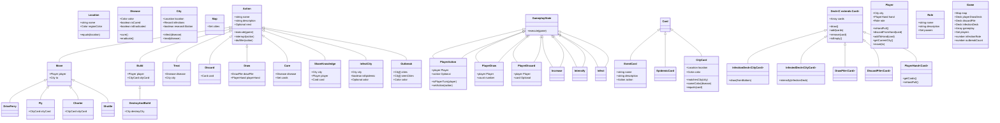

```mermaid
classDiagram
  class Location
  Location : +string name
  Location : +Color regionColor
  Location : +equals(location)

  class Disease
  Disease : +Color color
  Disease : +boolean isCured
  Disease : +boolean isEradicated
  Disease : +cure()
  Disease : +eradicate()

  class City
  City : +Location location
  City : +Record<Disease, number> infections
  City : +boolean researchStation
  City : +infect(disease)
  City : +treat(disease)

  class Map
  Map : +Set<City> cities

  class Action
  Action : +string name
  Action : +string description
  Action : +Optional<Action> next
  Action : +execute(game)
  Action : +interrupt(action)
  Action : +doAfter(action)

  Action <|-- Move
  Move : +Player player
  Move : +City to

  Move <|-- DriveFerry

  Move <|-- Fly
  Fly : +CityCard cityCard

  Move <|-- Charter
  Charter : +CityCard cityCard

  Move <|-- Shuttle

  Action <|-- Build
  Build : +Player player
  Build : +CityCard cityCard

  Build <|-- DestroyAndBuild
  DestroyAndBuild : +City destroyCity

  Action <|-- Treat
  Treat : +Disease disease
  Treat : +City city

  Action <|-- Discard
  Discard : +Card card

  Action <|-- Draw
  Draw : +DrawPile drawPile
  Draw : +PlayerHand playerHand

  Action <|-- Cure
  Cure : +Disease disease
  Cure : +Set<Card> cards

  Action <|-- ShareKnowledge
  ShareKnowledge : +City city
  ShareKnowledge : +Player player
  ShareKnowledge : +Card card

  Action <|-- InfectCity
  InfectCity : +City city
  InfectCity : +boolean isEpidemic
  InfectCity : +Optional<Color> color

  Action <|-- Outbreak
  Outbreak : +City[] cities
  Outbreak : +City[] seenCities
  Outbreak : +Color color

  class GameplayState
  GameplayState <|-- PlayerAction
  GameplayState <|-- PlayerDraw
  GameplayState <|-- PlayerDiscard
  GameplayState <|-- Increase
  GameplayState <|-- Intensify
  GameplayState <|-- Infect

  class Card
  Card <|-- EventCard
  EventCard : +string name
  EventCard : +string description
  EventCard : +Action action

  Card <|-- EpidemicCard

  Card <|-- CityCard
  CityCard : +Location location
  CityCard : +Color color
  CityCard : +matchesCity(city)
  CityCard : +sameColor(disease)
  CityCard : +equals(card)

  class Deck~C extends Card~
  Deck : +Array<C> cards
  Deck : +draw()
  Deck : +add(cards)
  Deck : +remove(card)
  Deck : +isEmpty()

  Deck <|-- InfectionDeck~CityCard~
  InfectionDeck : +draw(fromBottom)

  Deck <|-- InfectedDeck~CityCard~
  InfectedDeck : +intensify(infectionDeck)

  Deck <|-- DrawPile~Card~
  Deck <|-- DiscardPile~Card~

  Deck <|-- PlayerHand~Card~
  PlayerHand : +getCards()
  PlayerHand : +isHandFull()

  class Player
  Player : +City city
  Player : +PlayerHand hand
  Player : +Role role
  Player : +isHandFull()
  Player : +discardFromHand(card)
  Player : +addToHand(card)
  Player : +getCurrentCity()
  Player : +move(to)

  class Role
  Role : +string name
  Role : +string description
  Role : +Set<Action> powers

  class GameplayState
  GameplayState : +execute(game)

  GameplayState <|-- PlayerAction
  PlayerAction : +player Player
  PlayerAction : +action Optional<Action>
  PlayerAction : +isPlayerTurn(player)
  PlayerAction : +setAction(action)

  GameplayState <|-- PlayerDraw
  PlayerDraw : +player Player
  PlayerDraw : +count number

  GameplayState <|-- PlayerDiscard
  PlayerDiscard : +player Player
  PlayerDiscard : +card Optional<Card>

  GameplayState <|-- Increase
  GameplayState <|-- Intensify
  GameplayState <|-- Infect

  class Game
  Game : +Map map
  Game : +Deck playerDrawDeck
  Game : +Deck discardPile
  Game : +Deck infectionDeck
  Game : +Array<GameplayState> gameplay
  Game : +Set<Player> players
  Game : +number infectionRate
  Game : +number outbreakCount
```
